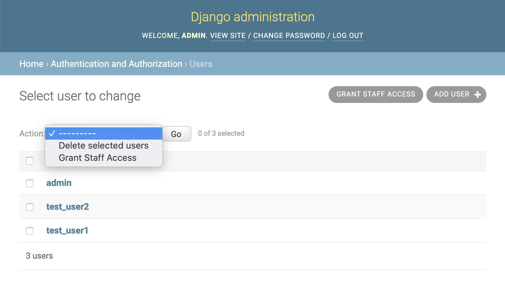
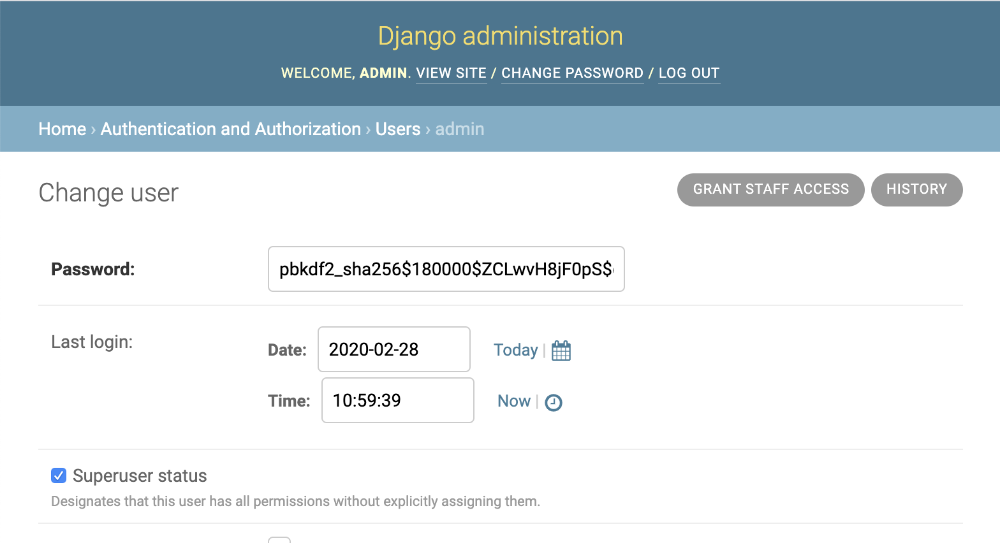
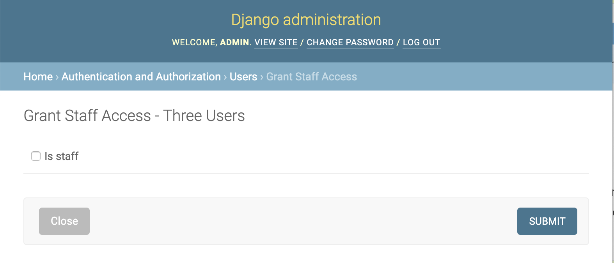
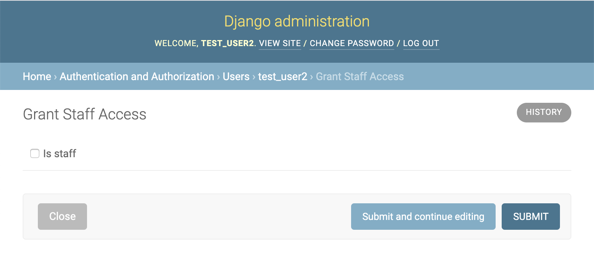

.. _tutorial:

Tutorial
========

This tutorial serves to show how to use the core aspects of ``daf``. Many
of the main benefits of using ``daf`` come as a result of decorating
your functions and action wrappers with
`python-args <https://github.com/jyveapp/python-args>`__ decorators.
Similarly, many of the advantages of reduced Django form and view boilerplate
comes as a result of ``daf`` using
`django-args <https://github.com/jyveapp/django-args>`__ for views. Some
of the main features of ``django-args``, which include dynamic conditional
form wizard steps, will not be covered in this tutorial. It is recommended
that the reader also read and understand how
`python-args <https://github.com/jyveapp/python-args>`__ and
`django-args <https://github.com/jyveapp/django-args>`__ work before
going through the ``daf`` tutorial.

Before we even go into constructing interfaces using ``daf``, we're first
going to cover the fundamentals of `Action` objects and the
corresponding `ObjectAction` and
`ObjectsAction` utilities that can be used to construct a
large amount of interfaces.

After we cover the basics, we will go over examples of defining views
and wizards, using views and wizards in the Django admin, and how to
construct Rest Framework actions.

The `Action` class and related subclasses
-----------------------------------------

The `Action` class is used to define an action in ``daf``.
The `Action` class is nothing special and only serves as a container
of attributes. These attributes help the action framework easily construct
a wide variety of views and interfaces.

As you saw in the quickstart from the introduction, one should either
define or import actions in the ``actions.py`` file of their Django app.
By placing your actions in ``actions.py``, they become accessible via the
action registry. Although it is not required to have all actions in
the registry, it facilitates other means of automatically importing
actions and constructing interfaces.

We continue where we left off in the quickstart with this action. As
mentioned, every action needs a ``callable`` attribute that points to
a function. One can use ``python-args`` decorators on the main function
to further integrate their functions into the associated interfaces that
are built from it:

.. code-block:: python

  import arg
  import daf.actions

  def is_granter_valid(granter):
      if not granter.is_staff:
          raise ValueError(f'Granter {granter} is not staff')

  @arg.validators(is_granter_staff)
  def grant_staff_access(user, is_staff):
      user.is_staff = is_staff
      user.save()
      return user

  class GrantStaffAccess(daf.actions.Action):
      callable = grant_staff_access
      app_label = 'examples'

When an action is defined like this, it can be easily integrated into
all of the different interfaces provided by the action framework - form
views, object views, bulk object views, admin and Rest Framework actions,
etc. This seamless integration is because the `Action` class
defines many default attributes that are common to a lot of interfaces.
Here are some of the main attributes and methods on the `Action` class:

- ``app_label`` (*str*): The app label under which the action belongs.
- ``callable`` (*func*): The callable code used by the action.
- ``name`` (*str*, *default=callable.__name__*): The name of the action.
- ``uri`` (*str*, *default={app_label}.{name}*): The unique name for the action
  among all actions.
- ``url_name`` (*str*, *default={app_label}_{name}*): The url name used when
  generating interfaces.
- ``url_path`` (*str*, *default={app_label}/{name-hyphenated}*): The url path
  used when generating interfaces.
- ``permission_codename`` (*str*, *default={app_label}_{name}_action*): The
  "codename" property of the ``Permission`` object that is
  automatically created for the action.
- ``permission_uri`` (*str*, *default=daf.{permission_codename}*): The unique
  permission named used when checking if a user has permission.
- ``display_name`` (*str*, *default={name-title-spaced}*): Used as a default
  title for UI views. Dynamic display names that need to use action instance
  variables are obtained by overriding `Action.display_name`.
- ``success_message`` (*str*, *default=generic_message*): The success message
  returned by UI views using the Django message framework.
  Success messages that are generated based on action arguments and
  results can override `Action.get_success_message`.
- ``success_url`` (*str*, *default='.'*): The success URL
  used by UI views when the action is successful.
  Success urls that are generated based on action arguments and
  results can override `Action.get_success_url`.
- ``wrapper`` (*func*, *default=arg.contexts(daf.contrib.attach_error_metadata)*):
  Wraps the callable every action run. Defaults to attaching metadata
  about exceptions that are raised.

All of these attributes are class properties. They can be overridden on
a child action class statically or dynamically using the
`daf.utils.classproperty` decorator. However, overridding is only necessary
when needing to add additional customization to all interfaces that use
an action.

The interfaces that are generated from actions either mirror these properties
directly or extend them.

The ``callable`` and ``wrapper``
~~~~~~~~~~~~~~~~~~~~~~~~~~~~~~~~

The two most important attributes of an action are the ``callable``
and the ``wrapper``. The callable is the function defined by the user and is
the core piece of logic called by the action. The ``wrapper`` is just
instrumentation on top of the action. It is used as a means to ensure
actions can be executed in similar manners across interfaces. Similar to
other attributes, the interfaces also typically further extend wrappers
so that interface-specific instrumentation happens.

By default, the ``wrapper`` of every action catches any exception thrown,
attaches additional ``daf`` context to the error, and re-raises it.
Doing this allows other actions and action interfaces to more elegantly
handle and render errors to users. The user should rarely be overriding the
wrapper in `Action` classes. It should instead be changed in any
abstract `Action` classes.

.. note::

  One needs to set ``abstract = True`` on abstract action classes in order
  to ensure those actions are not registered in the global action registry.

We will go into more examples of what the ``wrapper`` really means later
and how it is used, but for now the user only needs to know that these
two attributes are combined whenever an interface calls the action.

.. note::

  The main action function can be called by using ``Action.func``. We recommend
  to not depend on using this attribute or using it in testing though and
  instead promote the philosophy of testing individual action ``callable``
  functions.

The `ObjectAction` subclass
~~~~~~~~~~~~~~~~~~~~~~~~~~~

The `Action` class is the most free-form action and does not pigeonhole
the user into a specific way of running actions. However, as we will show
later when discussing interfaces, this action also requires the most
boilerplate and setup. If your action is operating over a single model
object, one can take advantage of the `ObjectAction` class.

The `ObjectAction` class requires a ``model`` and ``object_arg`` attribute.
It no longer requires an ``app_label`` since this is determined from
the ``model``. Since our ``GrantStaffAccess`` example is operating on
a ``User`` object, we can change the action definition to:

.. code-block:: python

  class GrantStaffAccess(daf.actions.ObjectAction):
      callable = grant_staff_access
      model = auth_models.User
      object_arg = 'user'

The ``object_arg`` is the name of the argument from ``callable`` that takes
the model object. In our case, the ``user`` argument is the object argument.

The addition of the ``object_arg`` attribute is important, because it is
used by the default ``wrapper`` of `ObjectAction`, which does the following:

1. Ensures that the ``callable`` can be called with an argument named
   ``object``. This makes a seamless integration with all of the associated
   ``daf`` object-based interfaces that automatically bind an argument
   called ``object``.
2. Automatically parametrizes the ``objects`` argument over the ``object``
   argument. This makes for a seamless integration with all of the bulk
   object interfaces provided by ``daf``. I.e. the ``callable`` function
   will seamlessly work with any interfaces that can operate on multiple
   objects without any additional effort by the user.
3. Wraps the parametrized ``callable`` in a few contexts that aid in
   instrumenting and catching bulk errors. Although this is not applicable
   to single-object runs of the actions, it means that any bulk runs will
   have better contextualized errors raised based on the failing objects.
   We will show more examples of this later.

While it is possible to override the ``wrapper`` for subclasses of
`ObjectAction`, it is useful to maintain these core wrappers so that certain
usability elements are maintained across all action interfaces. For example,
removal of the contextual error raisers will result in bulk object actions
only showing errors for the first failing object.

The `ObjectsAction` subclass
~~~~~~~~~~~~~~~~~~~~~~~~~~~~

Although we are only going to focus on `ObjectAction` examples in our
tutorial, the `ObjectsAction` subclass is available for users that
need to optimize bulk actions. For example, parametrizing an `ObjectAction`
will produce at least *N* queries where *N* is the number of objects
for a bulk object action. Although this may be acceptable for many use cases,
``daf`` does not force all actions into this.

Similar to `ObjectAction`, the `ObjectsAction` class requires an ``objects_arg``
to be specified, and the callable is assumed to take a queryset of objects
as an argument. Let's update our action to be compatible with a list of
objects:

.. code-block:: python

  import arg
  import daf.actions

  def is_granter_valid(granter):
      if not granter.is_staff:
          raise ValueError(f'Granter {granter} is not staff')

  @arg.validators(is_granter_staff)
  def grant_staff_access(granter, users, is_staff):
      users.update(is_staff=staff)
      return users

The ``wrapper`` for `ObjectsAction` also wraps the ``callable`` so that it
can take an ``object`` argument. When called this way, it will be
changed into a single-element ``objects`` argument, making the action
compatible with other single-object interfaces. Along with this, any
``objects`` iterables that are not querysets will be converted to a
queryset before ``callable`` is called.

Core action views
-----------------

As shown in the quickstart, ``daf`` comes with several core views. The
primary ones are:

- `daf.views.FormView`: For constructing a ``daf.views.FormView`` on an action.
  The view can be used by any actions, but the user needs to supply the
  parameters to the action via the form or via the ``get_default_args``
  method on the view.

- `daf.views.ObjectFormView`: A ``FormView`` that automatically passes
  an ``object`` argument to the action. Similar to django ``DetailView``
  classes, it must be supplied an object ID via the URL. Actions that
  are used by this view must take an ``object`` parameter, which is the
  default behavior of `ObjectAction` and `ObjectsAction` classes.

- `daf.views.ObjectsFormView`: A ``FormView`` that automatically passes
  an ``objects`` argument to the action. Similar to how ``ObjectFormView``
  obtains the object ID via the URL, the `daf.views.ObjectsFormView` uses the
  URL query parameters for loading multiple objects. Actions must accept
  an ``objects`` argument, which is the default behavior for `ObjectAction`
  and `ObjectsAction`.

Similar to Django ``DetailView`` classes, the `daf.views.ObjectFormView`
and `daf.views.ObjectsFormView` both make an ``object`` and ``objects`` variable
accessible on the view class and the view context. This can be useful
for making templates that are interoperable with both types of action
views. For example, this template works with both ``ObjectFormView``
and ``ObjectsFormView`` and changes the header accordingly::

  {{ form.media }}

  {{ view.display_name }}

   - One {{ view.model_meta.verbose_name }}
   - {{ objects|length|title }} {{ view.model_meta.verbose_name_plural }}

  <form action=".?{{ request.GET.urlencode }}" method="post" enctype="multipart/form-data">
    
    {{ form.as_p }}
    <button type="submit">
      Submit
    </button>
  </form>

As you might have noticed, we access the ``model_meta`` attribute on the view
in the template.
The `Action` class has many attributes, including the ``model_meta``
attribute, and many of these attributes are directly mirrored on the
action view. This allows us to create actions that have default attributes
across every interface while still maintaining the ability to customize
attributes per view.

We showed how to create a ``FormView`` in the quickstart. An ``ObjectFormView``
follows a nearly-indentical structure. Below shows all of the code needed,
including some minor modifications to the action definition and callable.

.. code-block:: python

  import arg
  from django import forms
  import django.contrib.auth.models as auth_models
  import daf.actions
  import daf.views

  def is_granter_valid(granter):
      if not granter.is_staff:
          raise ValueError(f'Granter {granter} is not staff')

  @arg.defaults(granter=arg.first('granter', arg.val('request').user))
  @arg.validators(is_granter_staff)
  def grant_staff_access(granter, users, is_staff):
      users.update(is_staff=staff)
      return users

  class GrantStaffAccess(daf.actions.ObjectAction):
      callable = grant_staff_access
      object_arg = 'user'
      model = auth_models.User

  class GrantStaffAccessForm(forms.Form):
      is_staff = forms.BooleanField(required=False)

  class GrantStaffAccessObjectFormView(daf.views.ObjectFormView):
      form_class = GrantStaffAccessForm
      template_name = 'examples/grant_staff.html'
      action = GrantStaffAccess

Some notes on the main changes from the previous example in our quickstart:

1. ``GrantStaffAccess`` now inherits `ObjectAction`, which requires defining
   ``object_arg`` and ``model``. Our object action is going to use "user"
   as the argument, and it will be a ``User`` model.
2. Instead of using ``get_default_args`` to pass in the granter, we instead
   use obtain the grant with an ``@arg.defaults`` decorator. By default,
   every action view makes the ``request`` argument available to every
   view. Using
   ``@arg.defaults(granter=arg.first('granter', arg.val('request').user))``
   means that the ``granter`` argument is going to be assign to either
   the ``granter`` argument that is used when calling the ``callable``, or
   the ``user`` from the ``request`` argument that is automatically available.
3. Since the ``ObjectFormView`` automatically makes the ``object`` argument
   available to the callable, and since the ``object`` argument is
   automatically mapped to the argument referenced by ``object_arg``, we only
   need to collect the ``is_staff`` flag in our form in this view. All
   other arguments to our callable are automatically handled as a result
   of the underlying ``python-args`` and ``django-args`` libraries.

Now that we have an `ObjectAction`, this means we can automatically make
a bulk update view like so:

.. code-block:: python

  class GrantStaffAccessObjectsFormView(daf.views.ObjectsFormView):
      form_class = GrantStaffAccessForm
      template_name = 'examples/grant_staff.html'
      action = GrantStaffAccess

There is no difference in the arguments. The only difference is the
type of url pattern that needs to be set up in order to create paths
to the views. This is automatically handled with the `daf.urls.get_url_patterns`
utility:

.. code-block:: python

  import daf.urls

  urlpatterns = daf.urls.get_url_patterns(
      [GrantStaffAccessObjectFormView, GrantStaffAccessObjectsFormView]
  )

Assuming our urls are included under ``/example/``, our generated URL
paths would be ``/examples/auth/user/grant-staff-access/<int:pk>/`` for
the `ObjectAction` and ``/examples/auth/user/grant-staff-access/`` for
the `ObjectsAction`. The `ObjectAction` parses the ``pk`` URL arguments
when determining which objects are being edited. For example,
``/examples/auth/user/grant-staff-access/?pk=1&pk=2&pk=3`` operates on
``User`` 1, 2, and 3.

.. note::

  The PK URL argument for ``ObjectFormView`` can be modified with the
  ``pk_url_kwarg`` attribute. The PK query argument for ``ObjectsFormView`` can
  be modified with the ``url_query_arg`` attribute.

Core action wizards
-------------------

Any action ``FormView`` or related subclass can also take advantage of
``daf`` wizard views. The wizard views in ``daf`` make use of
``django-args``, which builds on the
`django-formtools <https://django-formtools.readthedocs.io/en/latest/>`__
library.

``daf`` makes little modifications or additions to these core views. Although
we will cover the necessities here, we recommend reading
`django-args docs <https://github.com/jyveapp/django-args>`__
and `django-formtools docs <https://django-formtools.readthedocs.io/en/latest/>`__
to better understand how to utilize the wizard classes.

Similar to `daf.views.FormView`, one can use `daf.views.WizardView` as
the base class for any form wizard. For those unfamiliar with
`django-formtools <https://django-formtools.readthedocs.io/en/latest/>`__,
a wizard is just a set of Django forms that are shown in order. The
``WizardView`` manages showing the steps and collecting the data using
a storage backend. ``daf`` comes with the `daf.views.SessionWizardView` that
is already configured to use session storage as a backend.

Let's take our ``GrantStaffAccess`` action and make a wizard where
the user can select the granter, the user, and the staff flag in a wizard:

.. code-block:: python

  from django import forms
  import django.contrib.auth.models as auth_models
  import daf.views

  class GranterForm(forms.Form):
      granter = forms.ModelChoiceField(queryset=auth_models.User.objects.all())

  class UserForm(forms.Form):
      user = forms.ModelChoiceField(queryset=auth_models.User.objects.all())

  class StaffForm(forms.Form):
      is_staff = forms.BooleanField(required=False)

  class GrantStaffAccessWizard(daf.views.SessionWizardView):
      form_list = [GranterForm, UserForm, StaffForm]
      template_name = 'examples/grant_staff.html'
      action = GrantStaffAccess

The main difference with wizard classes is the ``form_list`` variable that must
list all steps of the wizard.

Creating the template for a wizard is very similar to a form view.
For example, this will render a "Next" button and also include the additional
data needed by the form wizard::

  {{ form.media }}

  {{ view.display_name }}

  <form action=".?{{ request.GET.urlencode }}" method="post" enctype="multipart/form-data">
    
    {{ wizard.management_form }}
    {{ form.as_p }}

    
        <button type="submit">Next</button>
    
      <button type="submit">
        Submit
      </button>
    
  </form>

To conditionally show steps, use the ``condition_dict`` attribute
on the wizard view. More examples of doing this are shown in
the `django-args docs <https://django-args.readthedocs.org>`__
and the `django-formtools docs <https://django-formtools.readthedocs.io/en/latest/wizard.html#conditionally-view-skip-specific-steps>`__.

The wizard views in ``daf`` are functionally no different than the standard
form views. Every form view we discussed in the previous section, including
``ObjectFormView`` and ``ObjectsFormView`` have corresponding wizard views
(`daf.views.ObjectWizardView` and `daf.views.ObjectsWizardView`) and
session wizard views
(`daf.views.SessionObjectWizardView` and `daf.views.SessionObjectsWizardView`).
URLs for associated wizard views can also be created the same way with
`daf.urls.get_url_patterns`.

Admin actions
-------------

``daf`` comes with a native integration into the Django admin, removing
the need to write template or URL paths for views. Along with this, it means
there is no boilerplate for authentication and URL protection.

We're going to continue strong with our ``GrantStaffAccess`` action and
integrated it into the Django admin. Before we create an admin, let's go
ahead and create three different admin views for our ``GrantStaffAccess``
action:

.. code-block:: python

    import daf.admin

    class GrantStaffAccessForm(forms.Form):
        is_staff = forms.BooleanField(required=False)

    class GrantStaffAccessModelView(daf.admin.FormView):
        action = GrantStaffAccess
        form_class = GrantStaffAccessForm

        def get_default_args(self):
            return {
                **super().get_default_args(),
                **{'objects': auth_models.User.objects.all()},
            }

    class GrantStaffAccessObjectView(daf.admin.ObjectFormView):
        action = GrantStaffAccess
        form_class = GrantStaffAccessForm

    class GrantStaffAccessObjectsView(daf.admin.ObjectsFormView):
        action = GrantStaffAccess
        form_class = GrantStaffAccessForm

We are creating three views because there are three different integration
points into the Django admin:

1. On the main model list page in the toolbar. Along with the default creation
   button, any `daf.admin.FormView` classes will automatically be presented
   here since they are not associated with a particular object or set of
   objects. In ``GrantStaffAccessModelView``, we are rendering a button to
   grant staff access to all users at once, hence why we set the ``objects``
   argument to every user in ``get_default_args``. As mentioned, these
   types of actions don't need to be associated with any objects. We are
   just using our action as an example.
2. On the action dropdown list from the model list page. These are where
   bulk actions are rendered by default, such as Django's default deletion
   action. Any `daf.admin.ObjectsFormView` actions will be rendered here.
3. On the toolbar for the detail view of the model. Along with the default
   history button, any `daf.admin.ObjectFormView` actions will be rendered
   here.

.. note::

  The rendering locations are the same for the wizard views, which
  include (but are not limited to) `daf.admin.SessionWizardView`,
  `daf.admin.SessionObjectWizardView`, and `daf.admin.SessionObjectsWizardView`.

When all actions are defined, one must inherit `daf.admin.ActionMixin`
in their admin and also provide the interfaces to the ``daf_actions``
attribute to register them:

.. code-block:: python

  class UserAdmin(daf.admin.ActionMixin, admin.ModelAdmin):
      daf_actions = [
          GrantStaffAccessModelView,
          GrantStaffAccessObjectView,
          GrantStaffAccessObjectsView,
      ]

  admin.site.register(User, UserAdmin)

When going to the ``User`` change list page, the admin looks like:

The bulk action appears as an option in the dropdown, and the action
that operates over every user is rendered as a button in the toolbar.

The detail page also renders a button in the toolbar for the
object action:

When selecting all objects and clicking on the bulk update action, the
page looks like:

The individual object update page looks like:

By default, all admin views are protected just like any other admin
page. Admin actions are also only rendered if the user has permission
to perform the action. This can be overridden on an individual view
basis or by setting the ``settings.DAF_ADMIN_ACTION_PERMISSIONS_REQUIRED``
to ``False`` as the default.

.. note::

  Corresponding wizard views (`daf.admin.SessionObjectWizardView`, etc)
  are rendered the same way in the admin. The primary difference is that
  a "Next" button appears until the final step.

Rest framework actions
----------------------

Similar to the Django admin, ``daf`` allows one to integrate actions
directly into `Django Rest Framework Viewsets <https://www.django-rest-framework.org/api-guide/viewsets/>`__.

Currently ``daf`` only supports object actions for viewsets using
the `daf.rest_framework.DetailAction` class. For example, let's turn
our ``GrantStaffAccess`` action into an API endpoint:

.. code-block:: python

  class GrantStaffAccessForm(forms.Form):
      is_staff = forms.BooleanField(required=False)

  class GrantStaffAccessObjectDRFAction(daf.rest_framework.DetailAction):
      action = GrantStaffAccess
      form_class = GrantStaffAccessForm

Similar to `daf.views.ObjectFormView`, `DetailAction` automatically makes
the ``request`` and ``object`` variable available, making our
``GrantStaffAccess`` action compatible out of the box.

You might have noticed something strange - our detail action for rest
framework is still using a form, even though we don't need to collect
input from the user. While it is not required to provide a ``form_class``
for `DetailAction` interfaces, using a ``form_class`` will automatically
clean any input before it is provided to our action. This helps in
reducing the boilerplate of having to cast numbers, parse datetimes, and
other tedious things when writing endpoints.

When we have our action defined, we still need to add it to the viewset.
Similar to how our admin integration works, viewsets must inherit
the `daf.rest_framework.ActionMixin` class and also provide actions
in the ``daf_actions`` class attribute. Here's our full viewset definition.

.. code-block:: python

  from django.contrib.auth.models import User
  from rest_framework import permissions
  from rest_framework import serializers
  from rest_framework import viewsets

  import daf.rest_framework

  class UserSerializer(serializers.Serializer):
      id = serializers.IntegerField(read_only=True)
      username = serializers.CharField()
      email = serializers.CharField()
      is_staff = serializers.BooleanField()

  class UserViewSet(daf.rest_framework.ActionMixin, viewsets.ModelViewSet):
      permission_classes = [permissions.IsAuthenticated]
      queryset = User.objects.all()
      serializer_class = UserSerializer
      daf_actions = [GrantStaffAccessObjectDRFAction]

With this configuration, our action will now appear as a detail endpoint
on the viewset.

By default, all exceptions raised by a `daf.rest_framework.DetailAction`
will be wrapped in `daf.rest_framework.raise_drf_error`, which will
turn any non-rest framework exception into a `daf.rest_framework.APIException`.

The `daf.rest_framework.APIException` is just a subclass of rest framework's
``APIException`` class, but has a default status code of 400.

By default, the `daf.rest_framework.raise_drf_error` wrapper simply re-raises
non-rest framework errors with the stringified error as the message.
However, if a Django ``ValidationError`` is raised,
`daf.rest_framework.raise_drf_error` will fill in the ``code`` of the
``APIException`` using the ``code`` from the ``ValidationError``.

Atomicity of actions
--------------------

All action classes that operate on objects (`daf.actions.ObjectAction` and
`daf.actions.ObjectsAction`) operate atomically by default, meaning that
a ``select_for_update`` is applied to the object(s) in question in a transaction
before running any validations or action code. If this behavior is
undesirable or if the user wishes to control atomicity manually, set
the ``select_for_update`` class variable on the action class to ``None``.

.. note::

    The ``select_for_update`` class attribute just passes the argument through
    to ``djarg.qset``. For more information about how to configure this
    parameter to suit your needs (such as skipping locked objects),
    see the `djarg docs <https://django-args.readthedocs.io>`__ and
    the `docs for select_for_update <https://docs.djangoproject.com/en/3.0/ref/models/querysets/#select-for-update>`__.
